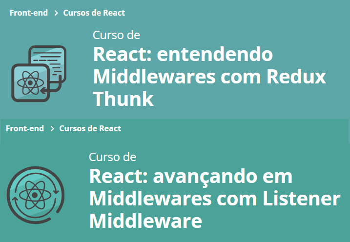

# Site Trato Tech entendendo Middlewares com Redux Thunk
- Redux Thunk
- Json Server
- Axios
- JavaScipt
- Criação de componentes e pages
- CSS modules
- React Router
- React Redux
- ReduxJS Toolkit
- React Hook Form

#### Vercel Pages: em breve

### Aula 1:
- Configurando o projeto :white_check_mark:
### Aula 2:
- Criar um servidor simulado com json-server; :white_check_mark:
- Buscar os dados deste servidor com axios; :white_check_mark:
- Adicionar os dados buscados dentro do reducer que criamos; :white_check_mark:
- A base do que é um useCallback; :white_check_mark:
- A base do porquê transferimos as imagens para a pasta public quando buscamos imagens sem imports. :white_check_mark:
### Aula 3:
- Criar um middleware, o que é um middleware e quando ele é executado; :white_check_mark:
- Criar um thunk com createAsyncThunk; :white_check_mark:
- Utilizar o extraReducers para adicionar actions de fora do slice. :white_check_mark:
### Aula 4:
- Utilizar o StrictMode e para que ele serve; :white_check_mark:
- Aproveitar os estágios do async thunk; :white_check_mark:
- Baixar e utilizar o standalone toast do chakra-ui. :white_check_mark:
### Aula 5:
- Aproveitar os estados de um async thunk para mostrar visualmente na tela; :white_check_mark:
- Adicionar casos em um reducer de actions que ocorrem em outro reducer; :white_check_mark:
- Como utilizar o addCase como um middleware, mesmo ele não sendo um. :white_check_mark:

# Rodar o projeto

In the project directory, you can run:

### `yarn server`
### `yarn start`

- App [http://localhost:3000](http://localhost:3000) to view it in your browser.
- Server categorias [http://localhost:3001/categorias](http://localhost:3001/categorias) to view it in your browser.
- Server itens [http://localhost:3001/itens](http://localhost:3001/itens) to view it in your browser.

# Getting Started with Create React App

This project was bootstrapped with [Create React App](https://github.com/facebook/create-react-app).

## Available Scripts

In the project directory, you can run:

### `yarn start`

Runs the app in the development mode.\
Open [http://localhost:3000](http://localhost:3000) to view it in your browser.

The page will reload when you make changes.\
You may also see any lint errors in the console.

### `yarn test`

Launches the test runner in the interactive watch mode.\
See the section about [running tests](https://facebook.github.io/create-react-app/docs/running-tests) for more information.

### `yarn build`

Builds the app for production to the `build` folder.\
It correctly bundles React in production mode and optimizes the build for the best performance.

The build is minified and the filenames include the hashes.\
Your app is ready to be deployed!

See the section about [deployment](https://facebook.github.io/create-react-app/docs/deployment) for more information.

## Learn More

You can learn more in the [Create React App documentation](https://facebook.github.io/create-react-app/docs/getting-started).

To learn React, check out the [React documentation](https://reactjs.org/).

### Advanced Configuration

This section has moved here: [https://facebook.github.io/create-react-app/docs/advanced-configuration](https://facebook.github.io/create-react-app/docs/advanced-configuration)

### Deployment

This section has moved here: [https://facebook.github.io/create-react-app/docs/deployment](https://facebook.github.io/create-react-app/docs/deployment)

### `yarn build` fails to minify

This section has moved here: [https://facebook.github.io/create-react-app/docs/troubleshooting#npm-run-build-fails-to-minify](https://facebook.github.io/create-react-app/docs/troubleshooting#npm-run-build-fails-to-minify)
